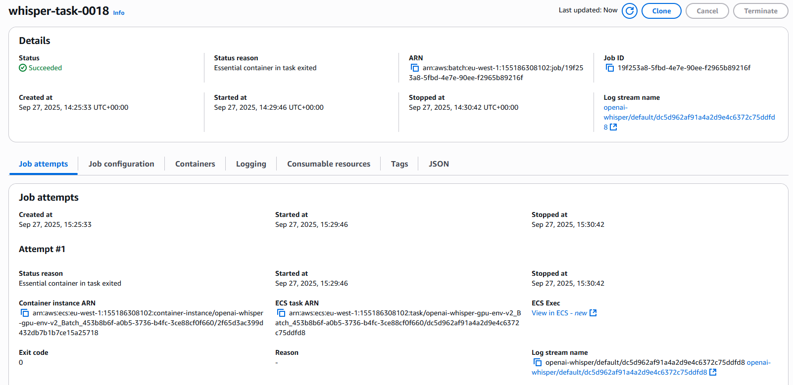
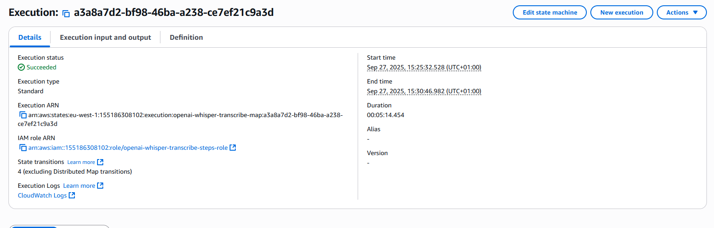
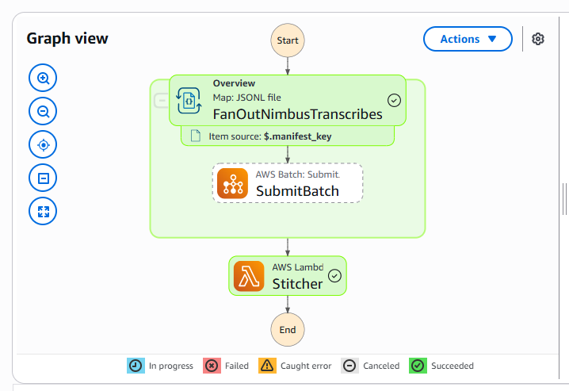
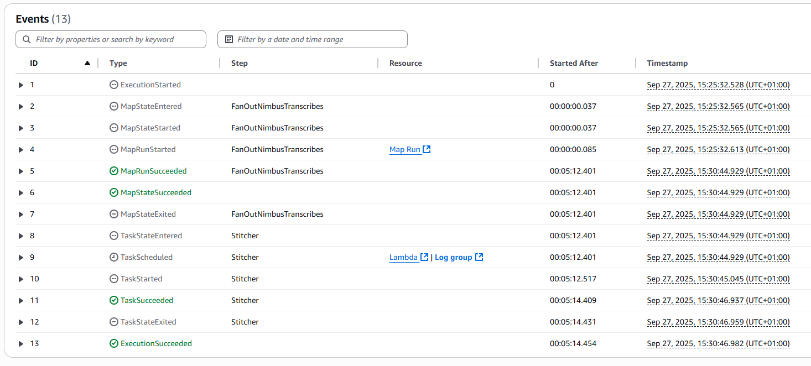
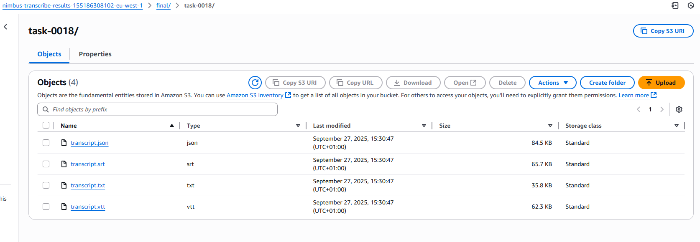

# Nimbus Transcribe — Demo Artifacts

This folder contains **evidence of the full Nimbus Transcribe pipeline in action**, from ingestion to transcription results.  
It is designed for recruiters, auditors, or collaborators to quickly verify that the infrastructure works end-to-end.

---

## 📸 Screenshots

| Step | Screenshot | Description |
|------|------------|-------------|
| 1 |  | AWS Batch job running Whisper on GPU (g5.xlarge). |
| 2 |  | State machine orchestration begins (Distributed Map). |
| 3 |  | Parallel chunk processing across GPU workers. |
| 4 |  | Workflow stitching results. |
| 5 |  | Final transcripts written to the results bucket. |

---

## 📂 Logs & Outputs

- **batch-logs-snippet.txt** → Extract from AWS Batch worker logs showing GPU inference.
- **sample-transcript-snippet.txt** → Example of final transcription output (JSON/TXT).
- **stepfunctions-run-20250928.json** → Raw execution record of the workflow.
- **sla-math.txt** → Notes on throughput, latency, and service-level assumptions.
- **cost-estimate.txt** → Estimated AWS cost breakdown for typical workloads.

---

## 🎥 Video Walkthrough

In addition to these artifacts, a **full video walkthrough** will be provided.  
It shows the live system in action: file upload → chunking → GPU inference → stitching → transcript delivery.

---

✅ Together, these artifacts provide **auditable proof** that Nimbus Transcribe is functional, scalable, and production-ready.
